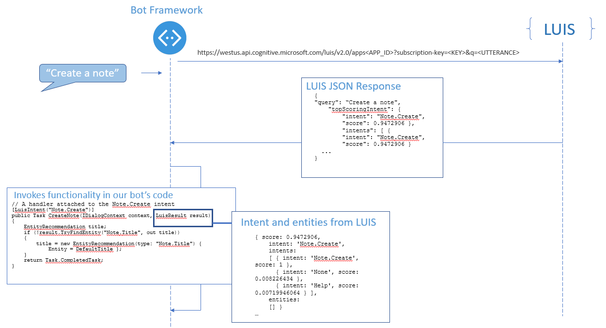

# Recognize intents and entities with LUIS 

This sample demonstrates how to build a note-taking bot that uses Language Understanding Intelligent Service (LUIS) to respond to natural language input. 

## Intents and utterances
A bot needs to detect what a user wants to do, which is their **intent**. This intent is determined from spoken or textual input, or **utterances**. The intent maps utterances to actions that the bot takes, such as invoking a dialog.

In the note-taking bot example, the following table shows how each intent maps to functionality. 

| Intent | Example Utterances | Bot functionality |
|------|----------------------|------|
| Note.Create | Create a note   Create a note called Grocery List   save a new note | CreateNote method |
| Note.Delete | Delete my note  Delete my Grocery List note    | DeleteNote method |
| Note.ReadAloud | Read my note  Read me the Grocery List note    | ReadNote method |

## Entities
A bot may also need to extract entities, which are important words in utterances. Sometimes entities are required to fulfill an intent. In the note-taking bot, the `Notes.Title` entity identifies the title of each note.

| Entity | Example Utterances | Value | Bot functionality |
|------|------|------|------|
| Notes.Title| Create a note called `ShoppingList` now   | "ShoppingList" | The CreateNote, DeleteNote, and ReadNote dialog use the title to save or find a note.   The dialogs prompt for it if a `Notes.Title` entity isn't detected in the utterance.|

When your bot receives an utterance, it can use either regular expressions or an intent recognition service like LUIS to determine the intent. To use LUIS, you configure a web service known as a **LUIS app** at [www.luis.ai][LUIS], and integrate it with your bot using the **LuisDialog** class. 

## Create your LUIS app
To create the LUIS app that provides the intents and entities to the bot, follow the steps in this section.

**Tip:** The LUIS app that the following steps create can also be imported from a [JSON file](Notes.json). To import the LUIS app in [www.luis.ai][LUIS], go to **My Apps** and click the **Import App** button.

1.	Log in to [www.luis.ai][LUIS] using your Cognitive Services API account. If you don't have an account, you can create a free account in the [Azure portal](https://ms.portal.azure.com). 
2.	In the **My Apps** page, click **New App**, enter a name like Notes in the **Name** field, and choose **Bootstrap Key** in the **Key to use** field. 
3.	In the **Intents** page, click **Add prebuilt domain intents** and select **Notes.Create**, **Notes.Delete** and **Notes.ReadAloud**.
4.	In the **Intents** page, click on the **None** intent. This intent is meant for utterances that don’t correspond to any other intents. Enter an example of an utterance unrelated to notes, like “Turn off the lights”.
5.	In the **Entities** page, click **Add prebuilt domain entities** and select **Notes.Title**.
6.	In the **Train & Test** page, train your app.
7.	In the **Publish** page, click **Publish**. After successful publish, copy the **Endpoint URL** from the **Publish App** page, to use later in your bot’s code. The URL has a format similar to this example: `https://westus.api.cognitive.microsoft.com/luis/v2.0/apps/3889f7d0-9501-45c8-be5f-8635975eea8b?subscription-key=67073e45132a459db515ca04cea325d3&timezoneOffset=0&verbose=true&q=`

## How LUIS passes intents and entities to your bot
The following diagram shows the sequence of events that happen after the bot receives an utterance from the user. First, the bot passes the utterance to the LUIS app and gets a JSON result from LUIS that contains intents and entities. Next, your bot automatically invokes any matching handler that your bot associates with the high-scoring intent in the LUIS result. The matching handler is specified by the **LuisIntent** attribute. 

## Create the LuisDialog class

To create a [dialog](https://docs.microsoft.com/en-us/bot-framework/dotnet/bot-builder-dotnet-dialogs) that uses LUIS, first create a class that derives from `LuisDialog` and 
specify the [LuisModel attribute](https://docs.microsoft.com/en-us/dotnet/api/microsoft.bot.builder.luis.luismodelattribute?view=botbuilder-3.8). 
To populate the `modelID` and `subscriptionKey` parameters for the `LuisModel` attribute, use 
the `id` and `subscription-key` attribute values from your LUIS application's endpoint. 

The `domain` parameter is determined by the Azure region to which your LUIS app is published. 
If not supplied, it defaults to `westus.api.cognitive.microsoft.com`.
See [Regions and keys](https://docs.microsoft.com/en-us/azure/cognitive-services/LUIS/manage-keys#regions-and-keys) for more information.

## Create methods to handle intents

Within the class, create the methods that execute when your LUIS model matches a user's utterance to intent. 
To designate the method that runs when a specific intent is matched, specify the `LuisIntent` attribute. 

## Try the bot

You can run the bot using the Bot Framework Emulator and tell it to create a note.

**Tip:** If you find that your bot doesn't always recognize the correct intent or entities, improve your LUIS app's performance by giving it more example utterances to train it. You can retrain your LUIS app without any modification to your bot's code. See [Add example utterances](https://docs.microsoft.com/en-us/azure/cognitive-services/LUIS/add-example-utterances) and [train and test your LUIS app](https://docs.microsoft.com/en-us/azure/cognitive-services/LUIS/train-test).

[LUIS]: https://www.luis.ai/