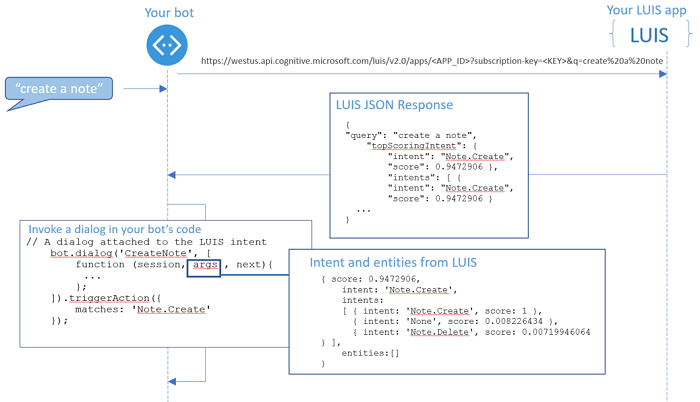

# Recognize intents and entities with LUIS 

This sample demonstrates how to build a note-taking bot that uses Language Understanding Intelligent Service (LUIS) to respond to natural language input. 

## Intents and utterances
A bot needs to detect what a user wants to do, which is their **intent**. This intent is determined from spoken or textual input, or **utterances**. The intent maps utterances to actions that the bot takes, such as invoking a dialog.

In the note-taking bot example, the following table shows how each intent maps to functionality. 

| Intent | Example Utterances | Bot functionality |
|------|----------------------|------|
| Note.Create | Create a note <br/> Create a note called Grocery List <br/> save a new note | CreateNote dialog |
| Note.Delete | Delete my note<br/> Delete my Grocery List note <br/>  | DeleteNote dialog |
| Note.ReadAloud | Read my note<br/> Read me the Grocery List note <br/>  | ReadNote dialog |

## Entities
A bot may also need to extract entities, which are important words in utterances. Sometimes entities are required to fulfill an intent. In the note-taking bot, the `Notes.Title` entity identifies the title of each note.

| Entity | Example Utterances | Value | Bot functionality |
|------|------|------|------|
| Notes.Title| Create a note called `ShoppingList` now   | "ShoppingList" | The CreateNote, DeleteNote, and ReadNote dialog use the title to save or find a note. <br> The dialogs prompt for it if a `Notes.Title` entity isn't detected in the utterance.|

When your bot receives an utterance, it can use either regular expressions or an intent recognition service like LUIS to determine the intent. To use LUIS, you configure a web service known as a **LUIS app** at [www.luis.ai][LUIS], and integrate it with your bot using the [LuisRecognizer][LuisRecognizer] and [Dialog][Dialog] classes. To recognize intent using regular expressions, see [Recognize intent](./bot-builder-nodejs-recognize-intent.md).

## How LUIS passes intents and entities to your bot
The following diagram shows the sequence of events that happen after the bot receives an utterance from the user. First, the bot passes the utterance to the LUIS app and gets a JSON result from LUIS that contains intents and entities. Next, your bot automatically invokes any matching dialog that your bot associates with the high-scoring intent in the LUIS result. The full details of the match, including the list of intents and entities that LUIS detected, are passed to the `args` parameter of the matching dialog.

<p align=center>

</p>


## Create your LUIS app
To create the LUIS app that provides the intents and entities to the bot, do the following steps.

    >[!TIP]
    >The LUIS app that the following steps create can also be imported from a [JSON file](Notes.JSON).

1.	Log in to [www.luis.ai][LUIS] using your Cognitive Services API account. If you don't have an account, you can create a free account in the [Azure portal](https://ms.portal.azure.com). 
2.	In the **My Apps** page, click **New App**, enter a name like Notes in the **Name** field, and choose **Bootstrap Key** in the **Key to use** field. 
3.	In the **Intents** page, click **Add prebuilt domain intents** and select **Notes.Create**, **Notes.Delete** and **Notes.ReadAloud**.
4.	In the **Intents** page, click on the **None** intent. This intent is meant for utterances that don’t correspond to any other intents. Enter an example of an utterance unrelated to weather, like “Turn off the lights”
5.	In the **Entities** page, click **Add prebuilt domain entities** and select **Notes.Title**.
6.	In the **Train & Test** page, train your app.
7.	In the **Publish** page, click **Publish**. After successful publish, copy the **Endpoint URL** from the **Publish App** page, to use later in your bot’s code. The URL has a format similar to this example: `https://westus.api.cognitive.microsoft.com/luis/v2.0/apps/3889f7d0-9501-45c8-be5f-8635975eea8b?subscription-key=67073e45132a459db515ca04cea325d3&timezoneOffset=0&verbose=true&q=`


## Create a note-taking bot integrated with the LUIS app
The code for the note-taking bot is in `basicNote.js`. To create this bot from scratch, you can first start with the sample code in [Create a bot with Node.js](https://docs.microsoft.com/en-us/bot-framework/nodejs/bot-builder-nodejs-quickstart#create-your-bot), and add code according to the instructions in the following sections.

### Create the bot 
Create the bot that communicates with the Bot Framework Connector service by instantiating a [UniversalBot][UniversalBot] object. The constructor takes a second parameter for a default message handler. This message handler sends a generic help message about the functionality that the note-taking bot provides, and initializes the `session.userData.notes` object for storing notes. You use `session.userData` so the notes are persisted for the user. Edit the code that creates the bot, so that the constructor looks like the following code:

``` javascript
// Create your bot with a function to receive messages from the user.
// This default message handler is invoked if the user's utterance doesn't
// match any intents handled by other dialogs.
var bot = new builder.UniversalBot(connector, function (session, args) {
    session.send("Hi... I'm the note bot sample. I can create new notes, read saved notes to you and delete notes.");

   // If the object for storing notes in session.userData doesn't exist yet, initialize it
   if (!session.userData.notes) {
       session.userData.notes = {};
       console.log("initializing userData.notes in default message handler");
   }
});
```

### Add a LuisRecognizer
The [LuisRecognizer][LuisRecognizer] class calls the LUIS app. You initialize a **LuisRecognizer** using the **Endpoint URL** of the LUIS app that you copied from the **Publish App** page. 

After you create the `UniversalBot`, add code to create the `LuisRecognizer` and add it to the bot: 

``` javascript
// Add global LUIS recognizer to bot
var luisAppUrl = process.env.LUIS_APP_URL || 'https://westus.api.cognitive.microsoft.com/luis/v2.0/apps/<YOUR_APP_ID>?subscription-key=<YOUR_KEY>';
bot.recognizer(new builder.LuisRecognizer(luisAppUrl));
```

### Add dialogs
Now that the notes recognizer is set up to point to the LUIS app, you can add code for the dialogs.  The [matches](https://docs.botframework.com/en-us/node/builder/chat-reference/interfaces/_botbuilder_d_.itriggeractionoptions.html#matches) property of the 
[triggerAction](https://docs.microsoft.com/en-us/bot-framework/nodejs/bot-builder-nodejs-dialog-actions#bind-a-triggeraction) attached to the dialog specifies the name of the intent. The recognizer runs each time the bot receives an utterance from the user. If the highest scoring intent that it detects matches a `triggerAction` bound to a dialog, the bot invokes that dialog.

``` javascript
// Add global LUIS recognizer to bot
var luisAppUrl = process.env.LUIS_APP_URL || 'https://westus.api.cognitive.microsoft.com/luis/v2.0/apps/<YOUR_APP_ID>?subscription-key=<YOUR_KEY>';
bot.recognizer(new builder.LuisRecognizer(luisAppUrl));
```

#### Add the CreateNote dialog
Any entities in the utterance are passed to the dialog using the `args` parameter. The first step of the waterfall calls `EntityRecognizer.findEntity` to get the title of the note from any `Note.Title` entities in the LUIS response. If the LUIS app didn't detect a `Note.Title` entity, the bot prompts the user for the name of the note. The second step of the waterfall prompts for the text to include in the note. Once the bot has the text of the note, the third step uses `session.userData` to save the note in a `notes` object, using the title as the key.


The following code for a CreateNote dialog handles the `Note.Create` intent.

``` javascript 
// CreateNote dialog
bot.dialog('CreateNote', [
    function (session, args, next) {
        // Resolve and store any Note.Title entity passed from LUIS.
        var intent = args.intent;
        var title = builder.EntityRecognizer.findEntity(intent.entities, 'Note.Title');

        var note = session.dialogData.note = {
          title: title ? title.entity : null,
        };
        
        // Prompt for title
        if (!note.title) {
            builder.Prompts.text(session, 'What would you like to call your note?');
        } else {
            next();
        }
    },
    function (session, results, next) {
        var note = session.dialogData.note;
        if (results.response) {
            note.title = results.response;
        }

        // Prompt for the text of the note
        if (!note.text) {
            builder.Prompts.text(session, 'What would you like to say in your note?');
        } else {
            next();
        }
    },
    function (session, results) {
        var note = session.dialogData.note;
        if (results.response) {
            note.text = results.response;
        }
        
        // If the object for storing notes in session.userData doesn't exist yet, initialize it
        if (!session.userData.notes) {
            session.userData.notes = {};
            console.log("initializing session.userData.notes in CreateNote dialog");
        }
        // Save notes in the notes object
        session.userData.notes[note.title] = note;

        // Send confirmation to user
        session.endDialog('Creating note named "%s" with text "%s"',
            note.title, note.text);
    }
]).triggerAction({ 
    matches: 'Note.Create',
    confirmPrompt: "This will cancel the creation of the note you started. Are you sure?" 
}).cancelAction('cancelCreateNote', "Note canceled.", {
    matches: /^(cancel|nevermind)/i,
    confirmPrompt: "Are you sure?"
});
```

If the LUIS app detects an intent that interrupts the `CreateNote` dialog, the `confirmPrompt` property of the dialog's `triggerAction` provides a prompt to confirm the interruption. For example, if the bot says "What would you like to call your note?", and the user replies "Actually, I want to delete a note instead", the bot prompts the user using the `confirmPrompt` message.

#### Add the DeleteNote dialog
In the `DeleteNote` dialog, the `triggerAction` matches the `Note.Delete` intent. As in the `CreateNote` dialog, the bot examines the `args` parameter for a title. If no title is detected, the bot prompts the user. The title is used to look up the note to delete from `session.userData.notes`. 

``` javascript
// Delete note dialog
bot.dialog('DeleteNote', [
    function (session, args, next) {
        if (noteCount(session.userData.notes) > 0) {
            // Resolve and store any Note.Title entity passed from LUIS.
            var title;
            var intent = args.intent;
            var entity = builder.EntityRecognizer.findEntity(intent.entities, 'Note.Title');
            if (entity) {
                // Verify that the title is in our set of notes.
                title = builder.EntityRecognizer.findBestMatch(session.userData.notes, entity.entity);
            }
            
            // Prompt for note name
            if (!title) {
                builder.Prompts.choice(session, 'Which note would you like to delete?', session.userData.notes);
            } else {
                next({ response: title });
            }
        } else {
            session.endDialog("No notes to delete.");
        }
    },
    function (session, results) {
        delete session.userData.notes[results.response.entity];        
        session.endDialog("Deleted the '%s' note.", results.response.entity);
    }
]).triggerAction({
    matches: 'Note.Delete'
}).cancelAction('cancelDeleteNote', "Ok - canceled note deletion.", {
    matches: /^(cancel|nevermind)/i
});
```

The `DeleteNote` dialog uses the `noteCount` function to determine whether the `notes` object contains notes.

``` javascript
// Helper function to count the number of notes stored in session.userData.notes
function noteCount(notes) {

    var i = 0;
    for (var name in notes) {
        i++;
    }
    return i;
}
```

#### Add the ReadNote dialog

For reading a note, the `triggerAction` matches the `Note.ReadAloud` intent. The `session.userData.notes` object is passed as the third argument to `builder.Prompts.choice`, so that the prompt displays a list of notes to the user.

``` javascript
// Read note dialog
bot.dialog('ReadNote', [
    function (session, args, next) {
        if (noteCount(session.userData.notes) > 0) {
           
            // Resolve and store any Note.Title entity passed from LUIS.
            var title;
            var intent = args.intent;
            var entity = builder.EntityRecognizer.findEntity(intent.entities, 'Note.Title');
            if (entity) {
                // Verify it's in our set of notes.
                title = builder.EntityRecognizer.findBestMatch(session.userData.notes, entity.entity);
            }
            
            // Prompt for note name
            if (!title) {
                builder.Prompts.choice(session, 'Which note would you like to read?', session.userData.notes);
            } else {
                next({ response: title });
            }
        } else {
            session.endDialog("No notes to read.");
        }
    },
    function (session, results) {        
        session.endDialog("Here's the '%s' note: '%s'.", results.response.entity, session.userData.notes[results.response.entity].text);
    }
]).triggerAction({
    matches: 'Note.ReadAloud'
}).cancelAction('cancelReadNote', "Ok.", {
    matches: /^(cancel|nevermind)/i
});
```

## Try the bot

You can run the bot using the Bot Framework Emulator and tell it to create a note.
<p align=center>

</p>


The use of `triggerAction` to match intents means that the bot can detect and react to intents for every utterance, even utterances that occur in the middle of the steps of a dialog. If the user is in the `CreateNote` dialog, but asks to create a different note before the dialog's conversation flow is complete, the bot detects the second `Note.Create` intent, and prompts the user to verify the interruption.


<p align=center>

</p>

## Use an IntentDialog 
As you can see from trying the bot, the behavior of a `triggerAction` that matches an intent is global and allows interruption of the currently active dialog. Allowing and handling interruptions is a flexible design that accounts for what users really do. However, if you prefer a simpler conversational flow in which other intents can't interrupt a dialog, you can use an `IntentDialog`. 

The code for a note-taking bot that uses `IntentDialog` is in `basicNote-intentDialog.js`. To convert the note-taking bot to use `IntentDialog` instead, start with the code in `basicNote.js` and do the following steps to modify it.

Instead of defining a default message handler in the bot constructor, replace the constructor with this code:
``` javascript
// Create your bot
var bot = new builder.UniversalBot(connector);
```

Modify the definition of the `LuisRecognizer` to match this code:

``` javascript
// Add global LUIS recognizer to bot
var luisAppUrl = process.env.LUIS_APP_URL || 'https://westus.api.cognitive.microsoft.com/luis/v2.0/apps/<YOUR_APP_ID>?subscription-key=<YOUR_KEY>';
var notesRecognizer = bot.recognizer(new builder.LuisRecognizer(luisAppUrl));
```

Define an `IntentDialog` using the following code:
``` javascript
var noteIntentsDialog = new builder.IntentDialog({
         recognizers: [notesRecognizer]
});

bot.dialog('/', noteIntentsDialog);
```

To handle the None intent that is triggered when no other intents are identified, add the following code:
``` javascript
// Handle the None intent
// This default message handler is invoked if the user's utterance doesn't
// match any other intents defined in the LUIS app.
noteIntentsDialog.matches('None', [
    function (session, args) {
    session.send("Hi... I'm the note bot sample. I can create new notes, read saved notes to you and delete notes.");

   // If the object for storing notes in session.userData doesn't exist yet, initialize it
   if (!session.userData.notes) {
       session.userData.notes = {};
       console.log("initializing userData.notes in default message handler");
   }
}]);
```

Replace the CreateNote dialog with the following code:
``` javascript
// Handle the Note.Create intent
noteIntentsDialog.matches('Note.Create', [
    function (session, args, next) {
        // Resolve and store any Note.Title entity passed from LUIS.
        var intent = args.intent;
        var title = builder.EntityRecognizer.findEntity(intent.entities, 'Note.Title');

        var note = session.dialogData.note = {
          title: title ? title.entity : null,
        };
        
        // Prompt for title
        if (!note.title) {
            builder.Prompts.text(session, 'What would you like to call your note?');
        } else {
            next();
        }
    },
    function (session, results, next) {
        var note = session.dialogData.note;
        if (results.response) {
            note.title = results.response;
        }

        // Prompt for the text of the note
        if (!note.text) {
            builder.Prompts.text(session, 'What would you like to say in your note?');
        } else {
            next();
        }
    },
    function (session, results) {
        var note = session.dialogData.note;
        if (results.response) {
            note.text = results.response;
        }
        
        // If the object for storing notes in session.userData doesn't exist yet, initialize it
        if (!session.userData.notes) {
            session.userData.notes = {};
            console.log("initializing session.userData.notes in CreateNote dialog");
        }
        // Save notes in the notes object
        session.userData.notes[note.title] = note;

        // Send confirmation to user
        session.endDialog('Creating note named "%s" with text "%s"',
            note.title, note.text);
    }
]);
```

Replace the DeleteNote dialog with the following code:
``` javascript
// Handle the Note.Delete intent
noteIntentsDialog.matches('Note.Delete', [
    function (session, args, next) {
        if (noteCount(session.userData.notes) > 0) {
            // Resolve and store any Note.Title entity passed from LUIS.
            var title;
            var intent = args.intent;
            var entity = builder.EntityRecognizer.findEntity(intent.entities, 'Note.Title');
            if (entity) {
                // Verify that the title is in our set of notes.
                title = builder.EntityRecognizer.findBestMatch(session.userData.notes, entity.entity);
            }
            
            // Prompt for note name
            if (!title) {
                builder.Prompts.choice(session, 'Which note would you like to delete?', session.userData.notes);
            } else {
                next({ response: title });
            }
        } else {
            session.endDialog("No notes to delete.");
        }
    },
    function (session, results) {
        delete session.userData.notes[results.response.entity];        
        session.endDialog("Deleted the '%s' note.", results.response.entity);
    }
]);
```

Replace the ReadNote dialog with the following code:
``` javascript
// Handle the Notes.ReadAloud intent
noteIntentsDialog.matches('Note.ReadAloud', [
    function (session, args, next) {
        if (noteCount(session.userData.notes) > 0) {
           
            // Resolve and store any Note.Title entity passed from LUIS.
            var title;
            var intent = args.intent;
            var entity = builder.EntityRecognizer.findEntity(intent.entities, 'Note.Title');
            if (entity) {
                // Verify it's in our set of notes.
                title = builder.EntityRecognizer.findBestMatch(session.userData.notes, entity.entity);
            }
            
            // Prompt for note name
            if (!title) {
                builder.Prompts.choice(session, 'Which note would you like to read?', session.userData.notes);
            } else {
                next({ response: title });
            }
        } else {
            session.endDialog("No notes to read.");
        }
    },
    function (session, results) {        
        session.endDialog("Here's the '%s' note: '%s'.", results.response.entity, session.userData.notes[results.response.entity].text);
    }
]);
```

## Next steps

As next steps, you may want to improve your note-taking bot's recognition of intents and entities, or add more functionality to it.

### Improve recognition
In the process of testing this simple notes bot, you may notice that the LUIS app doesn't always recognize the `Notes.Title` entity in an utterance. There may also be times when the LUIS app identifies the wrong intent. A LUIS app learns from example, so you can improve its performance by giving it more example utterances to train it. You can retrain your LUIS app without any modification to your bot's code.

* See [Add example utterances](https://docs.microsoft.com/en-us/azure/cognitive-services/LUIS/add-example-utterances) for an explanation of how to provide more example utterances to LUIS so it can learn.
* Once you've provided more utterances, you can [train and test your LUIS app](https://docs.microsoft.com/en-us/azure/cognitive-services/LUIS/train-test).

A more advanced way to improve the performance of the LUIS app is to add features:
*  See [Features in LUIS](https://docs.microsoft.com/en-us/azure/cognitive-services/LUIS/luis-concept-feature) for an explanation of what features are.
*  See [Improve performance using features](https://docs.microsoft.com/en-us/azure/cognitive-services/LUIS/add-features) for a walkthrough of adding features to a LUIS app.

### Add more functionality
To more functionality to a LUIS-integrated bot, consider whether the new functionality maps to an intent or an entity. You may need a new intent to map to a conversation flow or dialog, and you might need new entities for new parameters or options. For example, if you want your notes bot to also be able to set alarms, you need to add intents to recognize alarm-related utterances, and extract entities like the alarm time.

* See the [Alarm bot sample][AlarmBot] for an example of a simple bot that creates and deletes alarms, and automatically extracts times from user utterances. 

## Additional resources

To learn more about the actions you can associate with a recognized intent, see [Managing conversation flow](bot-builder-nodejs-manage-conversation-flow.md) and [Trigger actions using global handlers](bot-builder-nodejs-global-handlers.md).

For more information on LUIS, see the [LUIS documentation][LUISAzureDocs].

The [LUIS Bot sample][LUISBotSample] demonstrates how to build a more complex LUIS-integrated bot. Its LUIS app provides intents and entities for searching for hotels.


[LUIS]: https://www.luis.ai/

[LUISAzureDocs]: https://docs.microsoft.com/en-us/azure/cognitive-services/LUIS/Home

[Dialog]: https://docs.botframework.com/en-us/node/builder/chat-reference/classes/_botbuilder_d_.dialog.html

[IntentRecognizerSetOptions]: https://docs.botframework.com/en-us/node/builder/chat-reference/interfaces/_botbuilder_d_.iintentrecognizersetoptions.html

[LuisRecognizer]: https://docs.botframework.com/en-us/node/builder/chat-reference/classes/_botbuilder_d_.luisrecognizer


[LUISConcepts]: https://docs.botframework.com/en-us/node/builder/guides/understanding-natural-language/

[DisambiguationSample]: https://github.com/Microsoft/BotBuilder/tree/master/Node/examples/feature-onDisambiguateRoute

[IDisambiguateRouteHandler]: https://docs.botframework.com/en-us/node/builder/chat-reference/interfaces/_botbuilder_d_.idisambiguateroutehandler.html

[RegExpRecognizer]: https://docs.botframework.com/en-us/node/builder/chat-reference/classes/_botbuilder_d_.regexprecognizer.html

[AlarmBot]: https://github.com/Microsoft/BotBuilder/blob/master/Node/examples/basics-naturalLanguage/app.js

[LUISBotSample]: https://github.com/Microsoft/BotBuilder-Samples/tree/master/Node/intelligence-LUIS

[UniversalBot]: https://docs.botframework.com/en-us/node/builder/chat-reference/classes/_botbuilder_d_.universalbot.html
